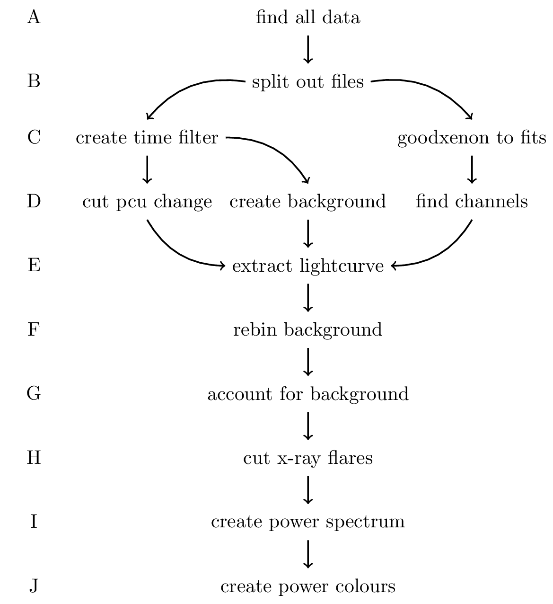

Master Project
=====
**Scripts for working with RXTE-data**

*Author*: David Gardenier

*Project*: Master Project @ Anton Pannekoek Institute for Astronomy

*Date*: July 2015 - July 2016

*Contact*: Contact davidgardenier@gmail.com for questions and
queries regarding the use of the presented software. For issues or ideas
please use the [github page for this software](https://github.com/astrocoding/master_project).

**Software Structure**

There are two parts to this repository:

TL;DR:
- \_hid: Scripts to create hardness intensity diagrams
- \_pc: Scripts to create power colour-colour diagrams

***hid***

Yet to come.

***pc***

Scripts to automate the extraction of light curves from RXTE data, create power
spectra and subsequently plot power colour colour diagrams for Aquila X-1

File structure of scripts is on basis of execution order, and built in modular
style. It is safe to run subscripts with larger letters (say J) without
changing the output of lower letters (say B). The same goes for files with the
same letter (C and C).

Essential to the data extraction is the dictionary with paths to different
files. This is updated as subscripts are executed, and allows subscripts to be
run multiple times without causing errors. Ideally this should be transformed
to a class, with functions returning the paths.

File structure:

