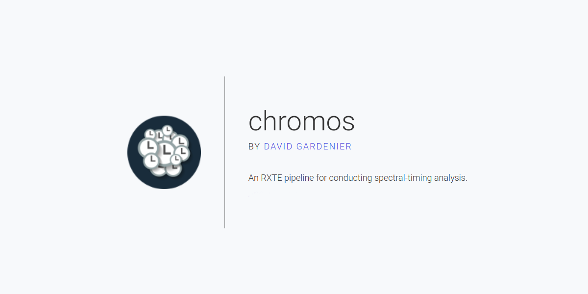

# Chromos

Chromos is a software pipeline written to automate the extraction and analysis of RXTE data, allowing a variety of spectral-timing properties to be determined for a large number of observations.

Please note that the bulk of this work was done between July 2015-2016 as part of a MSc project, and as such is not intend to be maintained.

## Installation
Software can be installed by cloning the Chromos repository, and may need additional supporting software if not present on the user's system. Chromos has been designed for use on Taurus, running Ubuntu 14.04.4. A list of required software is documented in REQUIREMENTS.txt, detailing the recommended version of particular software packages. To ensure the full pipeline works on Taurus, a virtual environment will need to be installed. However, those not doing energy spectral analysis can run Chromos without requiring a virtual environment with additional packages.

## Using Chromos
Chromos has been built in modular fashion, allowing for the quick toggling of required components. An overview of some of the current steps in Chromos is presented below, showing the order in which the pipeline must be run with main\_pipeline.py. Parameters for running this file are set in paths.py, which can be modified to reflect where data should be stored, under which name etc. The pipeline can be run over multiple sources using scripts in the misc folder, being quick hacks to change the paths file before running the main pipeline. As running Chromos on a full set of observations for a single source can take several hours, full Chromos runs are best run with screen, a command allowing scripts to continue to be run while disconnected from the terminal. The only required information apart from that presented in paths.py is a list of ObsIDs over which you wish to run Chromos. A list of ObsIDs can be found for each object using the HEASARC archive:
[http://heasarc.gsfc.nasa.gov/cgi-bin/W3Browse/w3browse.pl](http://heasarc.gsfc.nasa.gov/cgi-bin/W3Browse/w3browse.pl)

A choice can be made to run Chromos for extracting data, calculating power spectra, all the way up to calculating power colours. Additionally energy spectral analysis can also be done, if wished, skipping the whole timing analysis side of Chromos. Currently Chromos works for event, binned, goodxenon and std2 files, extracting all types to allow the choice of data mode to be determined only when necessary.

## Modules
The following paragraphs briefly explain the purpose of each step in Chromos, providing a way to choose which components are necessary in your own pipeline. A log of the latest run of each step is automatically saved, allowing for future reference. The abbreviation TA refers to timing analysis scripts, which aren't required to run energy spectral analysis, denoted with SA, and vice-versa.

*Download Data* Based primarily on scripts coded by Abbie Stevens, this script checks whether you already have a copy of the required ObsIDs, and if not, will download a copy from the NASA archives to the location specified in paths.py

*Locate Files* Using Phil Uttley's xtescan2, an overview of data files is created in each 'P-folder', the parent folders to the ObsID directories. This overview contains information on all locations, data types, observation dates etc, for each data file in the folder.

*Determine Info* A crucial step in Chromos, this code runs through all of the files created in the previous step, creates a database with separate entries of each data file and saves it to a csv file as given in paths.py. Despite occasional I/O problems regarding the speed of csv files, the decision for this data storage was made to ensure portability and user-friendliness. All subsequent steps require a database file, and will update it upon completion. If wishing to rerun Chromos in its entirety from this step, the database file is best deleted manually to prevent a contamination between previous runs and a new run.

*Spacecraft Filters* Following standard steps in the RXTE cookbook, GTI files are made to filter erroneous data such as when the observations are blocked by the Earth.

*GoodXenon to FITS* A necessary step in extracting GoodXenon data requires the original data files, consisting of two parts, to be matched together. Ideally this step would still take place, but on a different level, allowing Chromos to deal with goodxenon files in the same manner as other data modes.

*PCU Filters* To prevent a surge in current from contaminating data, a cut is made around the time at which the number of PCU changes.

*Create Backgrounds* Contamination from off-sources photons can be modelled with a background. This step creates background data files which are modelled of basis of the settings of the actual data files. Backgrounds can only be extracted at a maximum time resolution of 16s, and therefore require additional steps after extraction, and before using for analysis.

*Find Channels* Perhaps the most intricate part of Chromos, this script finds the channels required for the specified energy range. Determining these channels for each data file can currently only be done for one energy range at a time, but can easily be adapted.

*Extract LC and SP* The most time-consuming part of Chromos, requiring all output of the previous steps to be gathered for input here. Light curves are extracted for all data modes save for std2 files, for which both light curves and spectra are extracted. The latter are only extracted for PCU2, as it performed the most consistently over the course of the full RXTE mission. Currently all data is extracted at the same resolution, however support has been in built to allow for different resolutions per data file, with subsequent files still defined by data mode and maximum possible resolution.

*Correct for background (TA)* As background files are only extracted at a 16s time resolution, this script interpolates between values to obtain background rates at the same resolution as the required light curve. This is subtracted from the light curve, and saved to a new file for subsequent steps.

*Create Power Spectra (TA)* Another time-intensive step, this calculates a power spectrum for each observation, which is split up into multiple parts of a predefined length. As an essential step in calculating power colours, this code has been extensively commented.

*Create Power Colours (TA)* The final step in the timing analysis -- calculating power colours for as many power spectra as possible. Currently no simple way exists for extracting a simple file with ObsIDs and the corresponding power colours, as this currently requires filtering of the database. Scripts with these filters can be found in the misc folder, allowing power colours to be selected upon 3sigma constraints, timing resolution or otherwise.

*Create Responses (SA)* Script allowing response files to be generated for each spectrum, ready for input into xspec.

*Calculate HI (SA)* Based on Fortran scripts developed by Phil Uttley, this code calculates the hardness and intensity for in predefined energy bands, saving the results, like every other step, to the database.

## Accessing Data
All data calculated by Chromos can be found in the database, apart from in cases when size prohibited inclusion, in which case the path to the file is noted. Logs are also created by Chromos allowing individual files to be traced back through processing. The sheer size of the database leads to the pandas package being the recommended package with which to interact with the database. The amount of detail in each database requires substantial filtering on various parameters before running scripts over columns. Investigating the manner in which previous columns were created will be essential if you wish to filter this data yourself. Alternatively, self-made scripts could search for the various files created with Chromos, which should have recognizable and distinct names.

## Notes
Please note that the bulk of this work was done between July 2015-2016 as part of a MSc project, and as such is not intend to be maintained.

As a brief side note for those who are curious: the name Chromos is an amalgamation of Chroma (GR: colour) and Chronos (GR: god of time). Referring respectively to the power colour analysis Chromos is capable of, and the timing capabilities of RXTE, the name is designed to evoke the idea of time and evolution, and form a sense of reliability.

## Improvements
Some large-scale improvements which could be made to Chromos are the manner in which it deals with GoodXenon files, which could be substantially simplified, but also an rewrite to adopt a class structure. This would help allow Chromos to be more adaptable, giving more freedom for a wider range of extraction parameters. Scripts should also be written to filter the data created by Chromos to a simple data files with only the necessary parameters, allowing users to avoid the intricacies of data filtering. A lot of this functionality has already been developed for scripts in the misc folder, or scripts in the plots folder. The latter directory is perhaps the best place to start with learning how to obtain the required data from a database file, and will help in checking the data by using pre-coded plotting scripts.

## Author

[David Gardenier](http://www.davidgardenier.com) | MSc student at the [University of Amsterdam](http://www.uva.nl)
